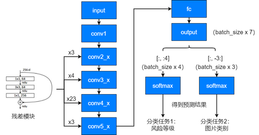
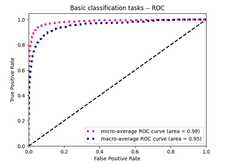
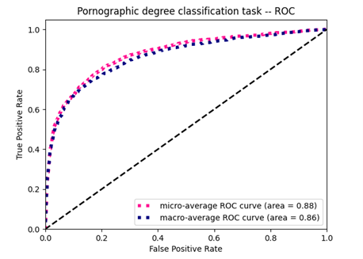
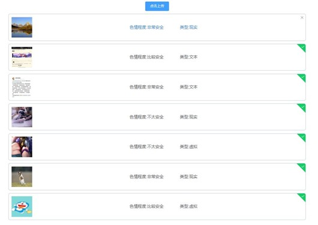

# 图片安全分级系统

一个基于 PyTorch、Flask 和 Vue 的图片安全分级项目，用于对图片进行风险等级识别和内容类型分类。

## ✨ 功能特性

- 多任务分类：同时预测风险等级与内容类型
- 模型训练：提供基于 ResNet101 的训练与测试脚本
- 在线推理：提供 Flask 推理接口
- 前端演示：提供 Vue 演示页面用于上传图片并查看结果
- 数据预处理：支持坏图检测、统一尺寸和简单数据分析

## 🎯 分类目标

- 风险等级：4 类
- 内容类型：3 类
- 模型输出维度：7

## 📊 数据集概况

- 原始数据规模：约 17000 张群聊图片
- 已完成标注：约 14990 张
- 训练集：11322 张
- 测试集：2068 张

数据主要来自真实群聊场景，包含生活、兴趣、文本截图、二次元图片和现实照片等多种类型，因此比单一的公开 NSFW 数据更贴近实际使用环境。

## 项目结构

```text
image-safety-classifier/
├─ backend/   # 推理接口与原始后端代码
├─ frontend/  # Vue 演示前端
├─ model/     # 训练、预测与预处理脚本
└─ docs/      # 项目补充说明
```

## 🛠️ 技术栈

- Python
- PyTorch
- Flask
- Vue 2
- Element UI
- MySQL

## 🧠 模型结构

项目采用 ResNet101 作为共享主干网络，在同一个 backbone 上同时完成两个分类任务：

- 任务 1：风险等级分类
- 任务 2：图片类型分类

模型结构示意如下：



## 📈 实验结果

### 图片类型分类任务

- micro-average ROC AUC：0.98
- macro-average ROC AUC：0.95



### 色情程度分类任务

- micro-average ROC AUC：0.88
- macro-average ROC AUC：0.86



从实验结果来看，图片类型分类任务表现更稳定，而色情程度分类任务相对更难，主要原因在于类别边界更模糊，人工标注也具有更强的主观性。

## 🖼️ 演示效果

前端支持上传图片并返回预测结果，示例界面如下：



## ⚠️ 当前局限

- 数据集仍存在类别分布不均衡问题，虚拟类图片占比较高
- 色情程度分级本身带有一定主观性，导致任务难度明显高于图片类型分类
- 仍有部分数据未完成标注，训练数据规模还有继续扩展空间

## 🚀 快速开始

### 1. 启动后端

```bash
cd backend
pip install -r requirements.txt
set MODEL_PATH=权重文件路径
python app.py
```

### 2. 启动前端

```bash
cd frontend
npm install
npm run dev
```

### 3. 训练模型

```bash
cd model
copy config.example.ini config.ini
python TorchModel.py --mode train --config config.ini
```

### 4. 单图预测

```bash
cd model
python predict.py --image 图片路径 --model 权重路径
```

### 5. 图片预处理

```bash
cd model
python ImgPreprocess.py --input-dir 原始目录 --output-dir 输出目录 --action unify
```

## 📁 模块说明

### `backend`

提供图片推理接口，接收上传图片并返回分类结果。

### `frontend`

提供一个简化的 Web 演示页面，用于上传图片并展示预测结果。

### `model`

包含训练、测试、单图预测和图片预处理脚本。

### `docs`

存放项目背景和实现思路等补充文档。
